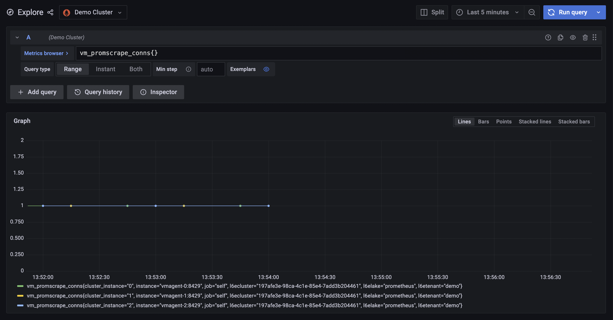

# Demo of how to run vmagent in cluster mode

By default, each scrape target is scraped only by a single vmagent instance in the cluster. If there is a need for replicating scrape targets among multiple vmagent instances, then 

```
--promscrape.cluster.replicationFactor=n
```
command-line flag must be set to the desired number of replicas. 

Where `n = the number of replicas`

It is required to use `replicationFactor=N` with `N>1` to enable HA, when `N=1` vmagent will only do sharding (splitting amount of work to lower for each instance), but nothing else.

If you don't desire replicas then you can skip setting this flag. vmagents does not share any information about other cluster members, so there is no way to understand if another one has crashed.

### Usage
```shell
$ docker-compose up
```

### What do you get to see?


